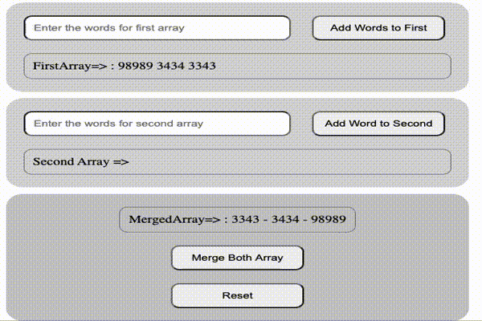

# Prupose of this code is to merge of two different arrays in one array

-This is about Merging Arrays

## Requirements

- All of the user input is taken by Add Buttons and adds to differen Arrays as an element
- When pressed the merge button all includes of arrays concats in the merged array.
  
  @ Understand look at the below picture

-----------------------

### Website Link of Project

- ! [Website Link] (https://code-code-team.github.io/CC0004J-Merge-Arrays/)

### ScreenShot of Merge Arrays

- 

----------------------- 

Copyright belogs to Aydin
